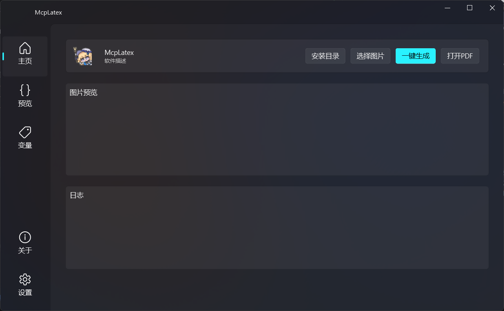
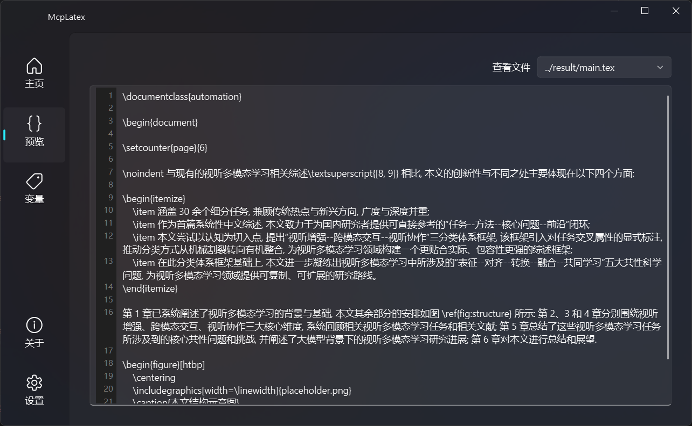
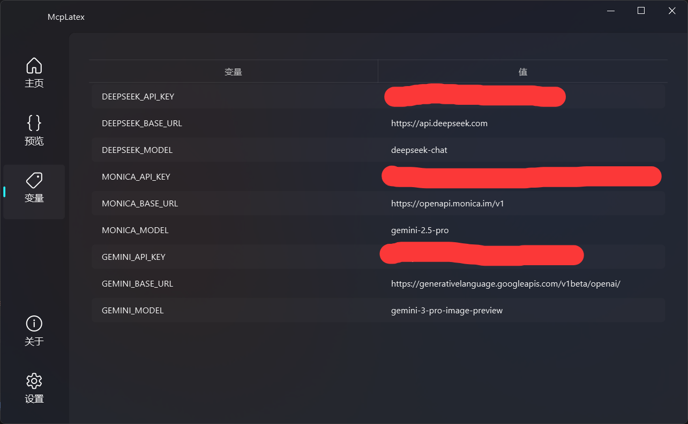

  <h1 align="center">
    
     
    TexFormat
  </h1> 
  
  

    一个基于agents的pdf文档格式识别工具，支持将pdf文档的纯文本提取为tex和格式化模板提取为cls。
     
    A pdf document format recognition tool based on agents, which supports extracting the plain text of pdf documents as tex files and extracting the formatted templates as cls files.
  

<!-- Badges -->

  

---
## 项目介绍
本项目核心基于`atomic agent`框架开发，结合`PySide6-fluent-widgets`开发GUI界面，能够将pdf文档的截图交由agents处理，将截图中的纯文本识别为可编辑的tex代码、格式模板识别为可编辑的cls类，使得使用者在编写论文时不必再拘泥于对应期刊的格式要求，只需专注于内容，而由agents完成格式化。

### 灵感来源
在编写论文时，往往许多人都因为期刊或学校的格式要求而头疼，出现明明内容写出来了，但是却因格式排版不符合要求而遭到论文打回。本项目的出现正是为了解决这一难点，让编者只需专注于论文内容的书写，格式部分交由本项目完成。

### 项目用途
识别对应期刊或学校的论文的截图，提取出其中的格式信息，将其保存为`LaTex`类代码，用户在编译自己的论文时，只需指定识别出来的类代码，就能使编译出来的PDF文档的格式符合要求。

---

## 项目部署

1. 环境要求：
    - `Windows 11 x64`，运行在Windows10下可能出现预期以外的问题。
    - `Python 3.13` 及以上版本
    - `MingW`工具链（后续可能更新不需要MingW工具链的版本）
2. 首次安装：
   - 将`res/env_template`复制到根目录，并重命名为`.env`，然后配置环境变量。
   - 运行`launcher.exe`，进行同步依赖和`TinyTex`下载。
   - 成功从`launcher.exe`运行后，即可在IDE中运行。

---
## 功能介绍

### 截图识别
通过`选择图片`将要识别的截图选中，然后点击一键生成即可生成对应的tex代码和cls类。
 

### 代码预览
用户可以预览并修改生成的tex代码和cls类，以及查看运行过程中的日志。（目前暂不支持修改生成的代码）

### 变量配置
可以快速在变量配置界面中配置环境变量。（暂时只能查看不能修改）
